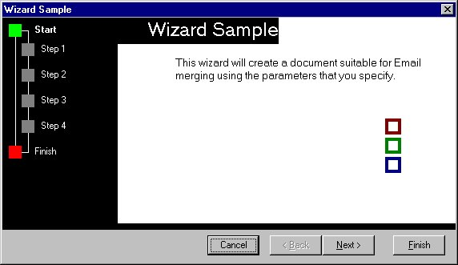



## Simle Wizard Sample

### Description

This code provides a relative easy way of displaying a step through wizard for gathering information.

This wizard sample looks like the Microsoft Word 97 resume wizard.

This code is very easy so I didn't include many comments.
 
### More Info
 

             |
---                |---
**Submitted On**   |2001-06-01 16:51:00
**By**             |[Benjamin Fourie](https://github.com/Planet-Source-Code/PSCIndex/blob/master/ByAuthor/benjamin-fourie.md)
**Level**          |Beginner
**User Rating**    |5.0 (25 globes from 5 users)
**Compatibility**  |VB 5\.0, VB 6\.0
**Category**       |[Custom Controls/ Forms/  Menus](https://github.com/Planet-Source-Code/PSCIndex/blob/master/ByCategory/custom-controls-forms-menus__1-4.md)
**World**          |[Visual Basic](https://github.com/Planet-Source-Code/PSCIndex/blob/master/ByWorld/visual-basic.md)
**Archive File**   |[Simle Wiza20391612001\.zip](https://github.com/Planet-Source-Code/benjamin-fourie-simle-wizard-sample__1-23678/archive/master.zip)

